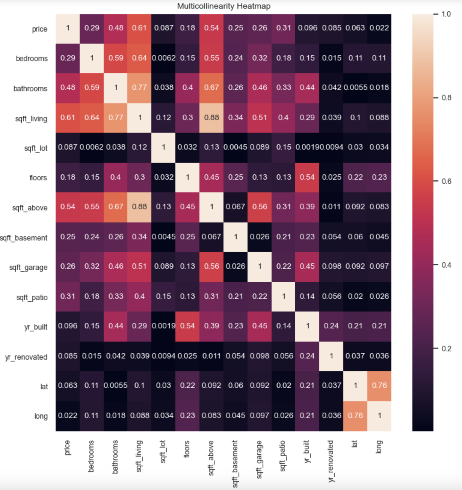
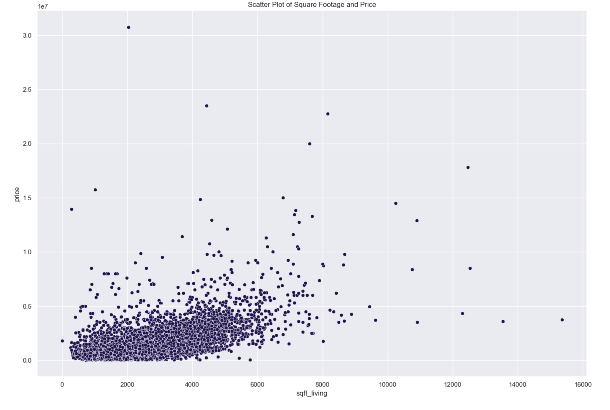

Copyright: (c) Jerryway | ![Dreamstime.com]


# Using Multiple Linear Regression for Home Prices in King County
***
##### Author: Deanna Gould
***
### Business Use
***
In this project, I will be evaluating home prices with a multiple linear regression model that can predict the home prices in King County as accurately as possible. The results can be used by a real estate investment firm looking to buy and remodel houses, or for homeowners who are interested in selling their home. 
***
### Method and Process
***
The first step in this project was be exploratory data analysis. The dataset for this project can be found in the Github for this project [https://github.com/deannagould/kingcountyhousing]. After exploring the data, simple and multiple linear regression analyses were performed. Some things that contributed to my logic throughout the project were the four assumptions of linear regression. The four assumptions of linear regression are linearity, multicollinearity, homoscedasticity, and normality. 

The null hypothesis of this project will be that the model does not have any ability to estimate home prices. On the other hand, rejecting the null hypothesis would mean that the model *is* able to predict home prices. The R-squared of the model summary will determine how *accurately* the model can predict home prices. In addition to R-squared, the Root Mean Squared Error (RMSE) and the Mean Absolute Error (MAE) will also be used to determine the model's efficacy and improvement throughout the project.

### Visualizations
***

<div>

</div>

This visual above shows the multicollinearity of different predictor variables. In this case, ideally we'd like to avoid using `sqft_above` as well as `sqft_living` so I used the most highly correlated to price which is `sqft_living`. 



The above visual shows a scatter plot prior to outlier removal. Seen above, we can see that some homes with the highest square foot living space actually have lower sale prices than those with a smaller square foot living area.

### Results
***
The final model had an R-squared of 0.657, which means that the model is accurately predicting 65.7% of home prices. The MAE of a model explains the average error of the model, so in this case the model has an average error of \\$169,097.32 USD. The Root Mean Squared Error of a model explains the difference between the true value and the value the model predicts, and in this project, the RMSE is \\$236,752.92 USD.

### Recommendations and Conclusions
***
Based on my findings from this multiple regression model, condition, amount of bedrooms, and amount of bathrooms have the greatest impact on price. Having a home in good or very good condition has a great impact on the selling price of the home. In addition to square footage, the number of bedrooms a home has is very important. If the home has available square footage, it would be a good investment to build an additional bedroom. That being said, with additional bedroom, it would also positively impact the sale price of the home if another bathroom were created. If the home doesn't already have space, but has enough land to add onto the home, that could be a very good option for homes with limited square footage.

### Next Steps

If I were to continue working on this project, I would try recreating the model in a different way by using the train test split method, as well as a log transformation. In addition, I would plot the zipcodes on a map to show the zip codes with the highest home prices. If the real estate investment firm is looking to improve homes of worse condition or in less expensive areas, then this model can be used for that as well. 


## For More Information
***
See the full analysis in the [Jupyter Notebook](https://github.com/deannagould/kingcountyhousing/blob/main/student.ipynb) or review this [presentation.](http://localhost:8889/files/MM%20Presentation.pdf)
For additional info, contact Deanna Gould at [deannagould4@gmail.com](deannagould4@gmail.com)

## Repository Structure

```

├── Presentation.pdf
├── README.ipynb
├── README.md
├── MulticollinearityHeatmap.png
├── ResidualDistribution.png
├── sqft_scatter.ipynb
├── KingCounty_view.png
└── Data
    ├── column_names.md
    └── kc_house_data.csv
